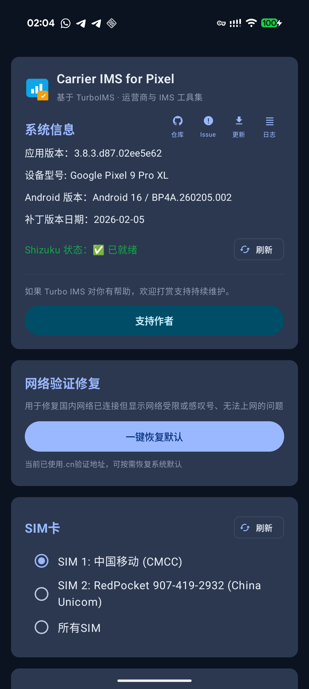
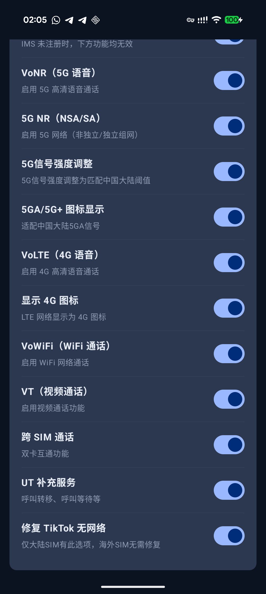

# Carrier IMS for Pixel (TurboIMS)

<p align="center">
  
</p>

<p align="center">
  <strong>面向 Google Pixel 的运营商与 IMS 工具集</strong><br/>
  在 Shizuku 权限下快速调优 VoLTE/VoWiFi/VoNR、5G 显示与网络兼容行为
</p>

<p align="center">
  中文（默认） | <a href="README_EN.md">English</a>
</p>

<p align="center">
  <a href="https://github.com/ryfineZ/TurboIMS/releases"></a>
  <a href="LICENSE"></a>
  
  
  
</p>

## 项目定位

本项目是基于 [Mystery00/TurboIMS](https://github.com/Mystery00/TurboIMS) 的持续维护分支，面向中国大陆与跨区使用场景做了大量交互与兼容性增强。  
目标是让普通用户也能更低门槛地完成 IMS 功能调优与问题排查。

## 界面预览

<p align="center">
  
  
</p>

## 功能矩阵

| 模块 | 能力 | 说明 |
|---|---|---|
| 系统信息 | 版本/设备/补丁/Shizuku 状态 | 集中展示运行环境，便于排障 |
| IMS 注册 | IMS 注册状态查询与手动注册 | 未注册时可一键触发注册流程 |
| 运营商能力 | VoLTE / VoWiFi / ViLTE / VoNR / UT / Cross‑SIM | 开关项实时生效，失败自动回滚并记录日志 |
| 5G 能力 | 5G NR / 5G 信号强度 / 5G+ 图标 | 适配中国大陆常见展示需求 |
| 网络修复 | 一键修复网络验证（captive portal） | 修复“已连接但网络受限/感叹号” |
| TikTok 修复 | 修复 TikTok 无网络（大陆 SIM） | 仅大陆 SIM 提供该选项，海外 SIM 默认无需修复 |
| 诊断工具 | 日志查看、配置全量查看、Issue 快捷上报 | 失败日志可直接附带到 Issue |
| 应用维护 | 应用内检查更新与下载安装 | 直接对接仓库 Release |

## 为什么这个分支更适合日常使用

- 更清晰的 UI 结构：核心操作入口前置，文案更贴近实际问题
- 更稳的写入策略：优先安全路径，失败可回退，避免高风险操作
- 更完整的排障链路：失败日志沉淀、系统信息复制、Issue 一步提交
- 新增网络能力诊断：支持对照 App 配置与 CarrierConfig 读回，定位更直接
- 界面进一步紧凑化：信息密度更高，常用按钮与卡片留白优化
- 更贴近国内网络环境：5G 显示与联网验证修复能力内置

## 快速开始

1. 从 [Releases](https://github.com/ryfineZ/TurboIMS/releases) 下载并安装 APK  
2. 安装并启动 [Shizuku](https://shizuku.rikka.app/zh-hans/)  
3. 打开 App，授权 Shizuku  
4. 选择 SIM，按需开启功能开关  

## 适用范围

- 设备：Pixel Tensor 平台（Pixel 6/7/8/9/10、Fold、Tablet）
- 系统：Android 13 及以上（建议 Android 14/15/16）
- 语言：简体中文 / English

## 构建（开发者）

```bash
./gradlew :app:assembleDebug
adb install -r app/build/outputs/apk/debug/app-debug.apk
```

如需本地签名，请在 `local.properties` 中配置：

```properties
SIGN_KEY_STORE_FILE=/path/to/your.keystore
SIGN_KEY_STORE_PASSWORD=***
SIGN_KEY_ALIAS=***
SIGN_KEY_PASSWORD=***
```

## 常见问题

### 1. IMS 仍未注册

- 先确认 Shizuku 已就绪  
- 检查 VoLTE / VoWiFi 是否可用  
- 使用日志与 Issue 上报能力收集现场信息

### 2. 网络有信号但无法上网

- 先检查 APN 是否缺失或异常  
- 再尝试“网络验证修复”功能  

### 3. TikTok 仍不可用

- 仅大陆 SIM 才会出现“修复 TikTok 无网络”开关  
- 变更后建议重启目标 App 或清理其会话缓存再测试

## 更新记录

- 详细版本变更见 [CHANGELOG.md](CHANGELOG.md)
- 历史发布见 [Releases](https://github.com/ryfineZ/TurboIMS/releases)

## 致谢

- [Mystery00/TurboIMS](https://github.com/Mystery00/TurboIMS)
- [vvb2060/Ims](https://github.com/vvb2060/Ims)
- [kyujin-cho/pixel-volte-patch](https://github.com/kyujin-cho/pixel-volte-patch)
- [nullbytepl/CarrierVanityName](https://github.com/nullbytepl/CarrierVanityName)

## 免责声明

本应用会修改系统运营商相关配置，仅用于学习、测试与自有设备调优。请自行评估风险并对操作结果负责。

## License

Apache-2.0
